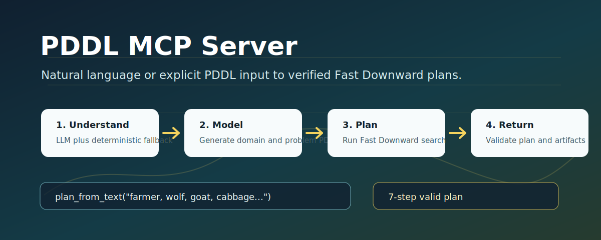
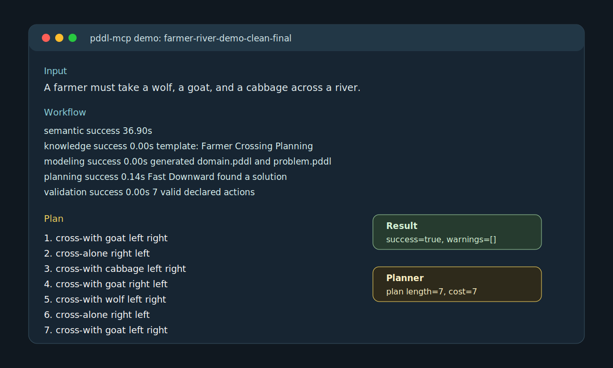
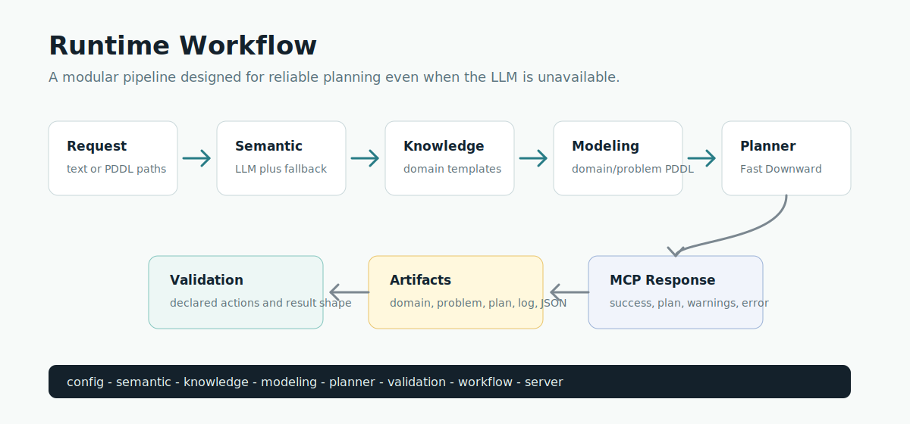

# PDDL MCP Server

<p align="center">
  
</p>

PDDL MCP Server is a personal MCP backend project for turning natural-language planning requests or explicit PDDL files into executable Fast Downward plans.

It is designed as a clean single-version planning service: understand the task, match domain knowledge, generate PDDL, run a planner, validate the result, and return a structured MCP response with artifacts.

## Highlights

- Natural language to PDDL workflow through `plan_from_text`.
- Direct PDDL planning through `generate_plan` with `domain_path` and `problem_path`.
- Configurable LLM semantic parsing with deterministic local fallback.
- Fast Downward integration for real planner execution.
- Generated artifacts for every run: `domain.pddl`, `problem.pddl`, `sas_plan`, planner log, and `result.json`.
- Stable MCP tool response shape for downstream agents or clients.
- Tests for config loading, semantic fallback, domain matching, PDDL generation, planning, validation, and MCP responses.

## Demo

The project can solve the classic farmer, wolf, goat, and cabbage river-crossing puzzle.

<p align="center">
  
</p>

Input:

```text
A farmer must take a wolf, a goat, and a cabbage across a river.
The boat must be driven by the farmer and can carry at most one item.
If the farmer is absent, the wolf eats the goat and the goat eats the cabbage.
Plan how to move everything safely to the other side.
```

Output plan:

```text
(cross-with goat left right)
(cross-alone right left)
(cross-with cabbage left right)
(cross-with goat right left)
(cross-with wolf left right)
(cross-alone right left)
(cross-with goat left right)
```

This is a valid 7-step solution: take the goat first, return alone, move the cabbage, bring the goat back, move the wolf, return alone, and take the goat across again.

## Architecture

<p align="center">
  
</p>

The code is intentionally split into focused modules:

| Module | Responsibility |
| --- | --- |
| `config` | Load `.env` and runtime settings. |
| `semantic` | Convert natural language into a semantic planning representation. |
| `knowledge` | Match the task to a domain template. |
| `modeling` | Generate domain/problem PDDL. |
| `planner` | Build and run the Fast Downward command. |
| `validation` | Validate declared plan actions and result shape. |
| `workflow` | Orchestrate the full planning pipeline. |
| `server` | Expose MCP tools through FastMCP. |

## Project Layout

```text
pddl-mcp/
├── pyproject.toml
├── server.py
├── .mcp.json
├── docs/
│   ├── assets/
│   └── releases/
├── src/pddl_mcp/
│   ├── config.py
│   ├── knowledge.py
│   ├── modeling.py
│   ├── planner.py
│   ├── semantic.py
│   ├── server.py
│   ├── validation.py
│   ├── workflow.py
│   └── resources/domain_templates.json
└── tests/
```

## Installation

```bash
git clone https://github.com/NBNBTM/pddl-mcp-server.git
cd pddl-mcp-server
python -m pip install -e ".[dev]"
cp .env.example .env
```

## Configuration

Edit `.env` for your local runtime.

Minimal configuration:

```bash
OUTPUT_DIR=output
LOG_LEVEL=INFO
```

Real Fast Downward planning:

```bash
FAST_DOWNWARD_PATH=/absolute/path/to/fast-downward.py
FAST_DOWNWARD_SEARCH=astar(blind())
MAX_PLANNING_TIME=300
```

Optional LLM semantic parsing:

```bash
LLM_API_URL=https://your-llm-endpoint.example/v1/chat/completions
LLM_API_KEY=...
LLM_MODEL=qwen-max
LLM_TIMEOUT=120
LLM_RETRIES=2
```

`LLM_API_TOKEN` is also supported as a backward-compatible alias when `LLM_API_KEY` is empty.

Do not commit real `.env` files or API keys. The repository only includes `.env.example`.

## Fast Downward Setup

One local setup option:

```bash
mkdir -p .tools
git clone https://github.com/aibasel/downward.git .tools/downward
cd .tools/downward
python build.py
```

Then set:

```bash
FAST_DOWNWARD_PATH=/absolute/path/to/pddl-mcp-server/.tools/downward/fast-downward.py
```

`.tools/` is ignored by Git, so local planner builds are not uploaded.

## Run The MCP Server

```bash
python server.py
```

The root `server.py` is a compatibility entry point. The actual implementation lives in `pddl_mcp.server`.

## Python Usage

```python
from pddl_mcp.workflow import plan_from_text_response

result = plan_from_text_response(
    "Move robot r1 from room1 to room3",
    {"task_id": "robot-demo"},
)

print(result["success"])
print(result["plan_content"])
```

River-crossing example:

```python
from pddl_mcp.workflow import plan_from_text_response

text = """
A farmer must take a wolf, a goat, and a cabbage across a river.
The boat must be driven by the farmer and can carry at most one item.
If the farmer is absent, the wolf eats the goat and the goat eats the cabbage.
"""

result = plan_from_text_response(text, {"task_id": "farmer-river-demo"})
print(result["plan_content"])
```

## MCP Tools

### `plan_from_text`

```text
plan_from_text(text: str, options: dict | None = None)
```

Runs the complete natural-language workflow:

```text
text -> semantic parsing -> knowledge match -> PDDL generation -> planning -> validation
```

### `generate_plan`

```text
generate_plan(task: dict)
```

Supports two modes:

```json
{
  "description": "Move robot r1 from room1 to room3"
}
```

or:

```json
{
  "domain_path": "/path/to/domain.pddl",
  "problem_path": "/path/to/problem.pddl"
}
```

### `validate_config`

Checks whether Fast Downward and LLM settings are configured correctly.

### `get_system_info`

Returns server capabilities, Python version, platform, project root, and output directory.

## Response Shape

Every planning response follows the same structure:

```json
{
  "success": true,
  "task_id": "farmer-river-demo",
  "plan_content": "...",
  "explanation": "...",
  "artifacts": {
    "domain_path": "...",
    "problem_path": "...",
    "plan_path": "...",
    "log_path": "...",
    "result_path": "..."
  },
  "workflow_steps": [
    {
      "name": "planning",
      "success": true,
      "duration_sec": 0.136,
      "message": ""
    }
  ],
  "warnings": [],
  "error": ""
}
```

## MCP Client Configuration

The repository includes `.mcp.json`:

```json
{
  "mcpServers": {
    "pddl-planner": {
      "command": "python",
      "args": ["server.py"],
      "cwd": "."
    }
  }
}
```

For desktop MCP clients, use the absolute project path in `cwd` if relative paths are not supported by your client.

## Testing

```bash
python -m compileall -q src tests server.py
python -m pytest -q -p no:cacheprovider
python -m ruff check . --no-cache
```

Expected local result:

```text
13 passed
All checks passed
```

If `FAST_DOWNWARD_PATH` is not configured, real planner execution reports a clear configuration warning. Mock workflow tests still run.

## Release Notes

The current release draft is available at:

- [docs/releases/v4.0.0.md](docs/releases/v4.0.0.md)

## Security Notes

- Do not commit `.env`, API keys, model tokens, or private planner outputs.
- Keep local Fast Downward builds under `.tools/`.
- Generated outputs belong under `output/`.
- Both `.tools/` and `output/` are ignored by Git.

## License

This project is released under the MIT License.
